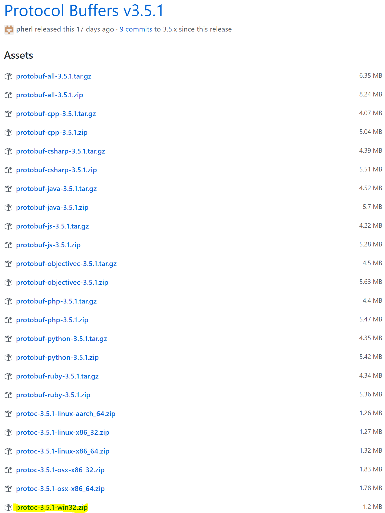
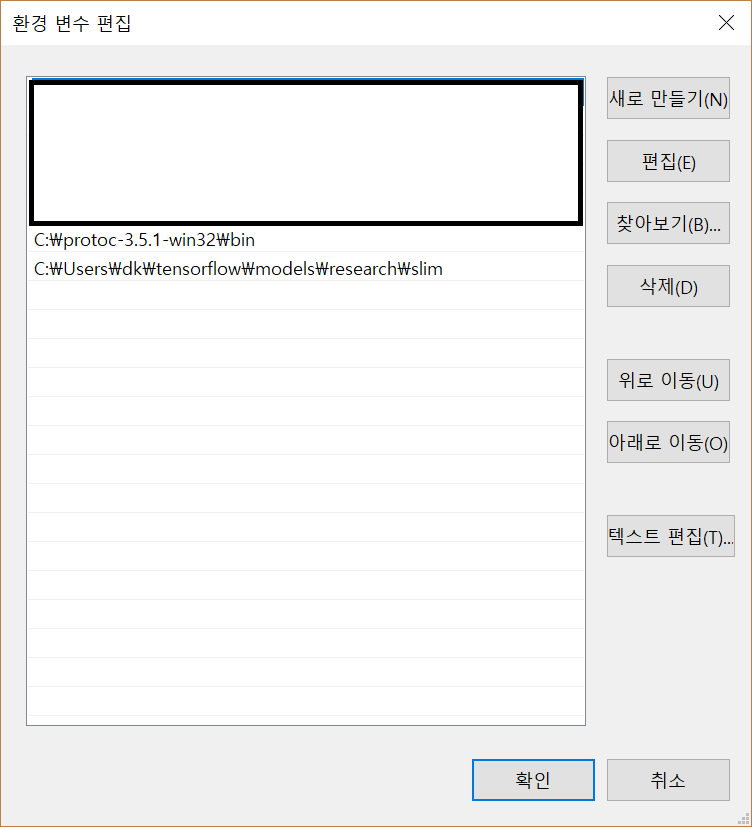
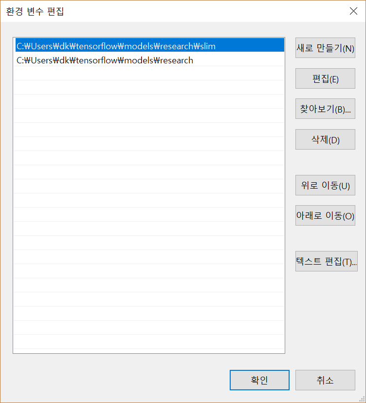

# Object Detection Setup on Windows

It was written with reference to the Object Detection installation.md

https://github.com/tensorflow/models/blob/master/research/object_detection/g3doc/installation.md

## Dependencies

- Protobuf 2.6

- Pillow 1.0

- lxml

- tf Slim (which is included in the "tensorflow/models/research/" checkout)

- Jupyter notebook

- Matplotlib

- Tensorflow

Install modules using pip. For example

`pip install tensorflow`

## Install Protobuf

Download release files at protobuf git repository. Must download 

[Protobuf download release link](https://github.com/google/protobuf/releases)

`protoc-{version}-win32.zip`




This is at the bottom of release. Unzip the .zip file and move to properly directory. And then, add {your_directory}\protoc\bin at Path environment variable.




## Compilation Protobuf

[Related github issue](https://github.com/tensorflow/models/issues/1591)

```
# From tensorflow/models/research/
protoc --python_out=. .\object_detection\protos\anchor_generator.proto .\object_detection\protos\argmax_matcher.proto .\object_detection\protos\bipartite_matcher.proto .\object_detection\protos\box_coder.proto .\object_detection\protos\box_predictor.proto .\object_detection\protos\eval.proto .\object_detection\protos\faster_rcnn.proto .\object_detection\protos\faster_rcnn_box_coder.proto .\object_detection\protos\grid_anchor_generator.proto .\object_detection\protos\hyperparams.proto .\object_detection\protos\image_resizer.proto .\object_detection\protos\input_reader.proto .\object_detection\protos\losses.proto .\object_detection\protos\matcher.proto .\object_detection\protos\mean_stddev_box_coder.proto .\object_detection\protos\model.proto .\object_detection\protos\optimizer.proto .\object_detection\protos\pipeline.proto .\object_detection\protos\post_processing.proto .\object_detection\protos\preprocessor.proto .\object_detection\protos\region_similarity_calculator.proto .\object_detection\protos\square_box_coder.proto .\object_detection\protos\ssd.proto .\object_detection\protos\ssd_anchor_generator.proto .\object_detection\protos\string_int_label_map.proto .\object_detection\protos\train.proto
.\object_detection\keypoint_box_coder.proto
```

## Add Libraries to PYTHONPATH



if not fount nets moules, try add slim directory at Path environment variable like below.


## Testing the installation

```
python object_detection/builders/model_builder_test.py
```
